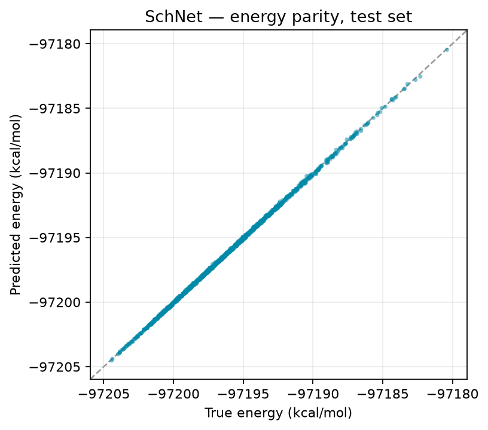
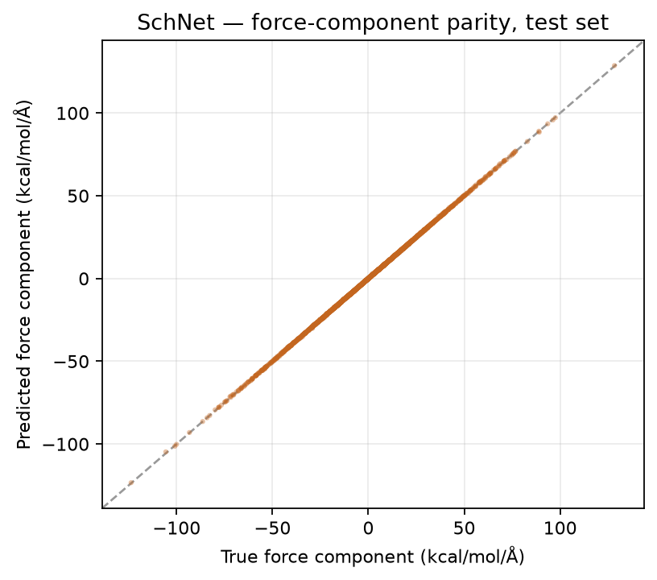
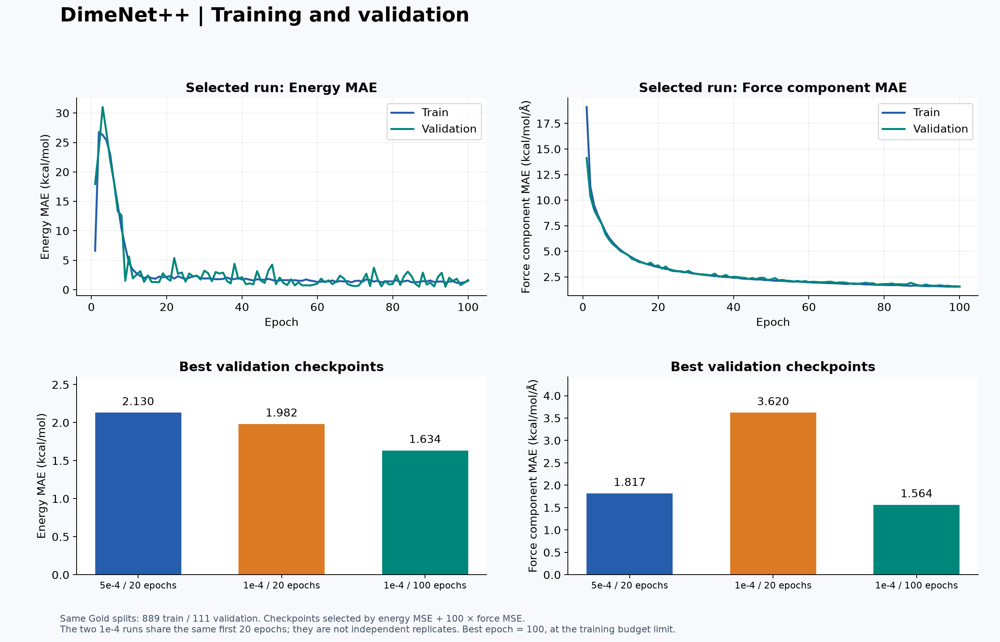
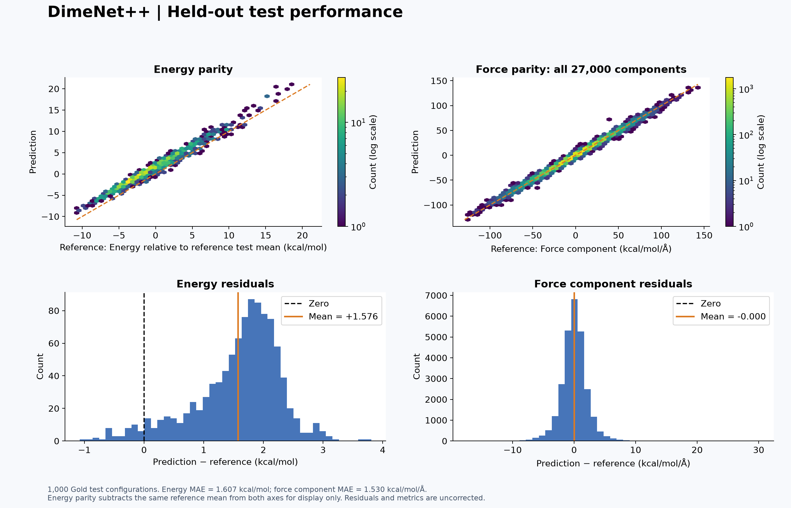
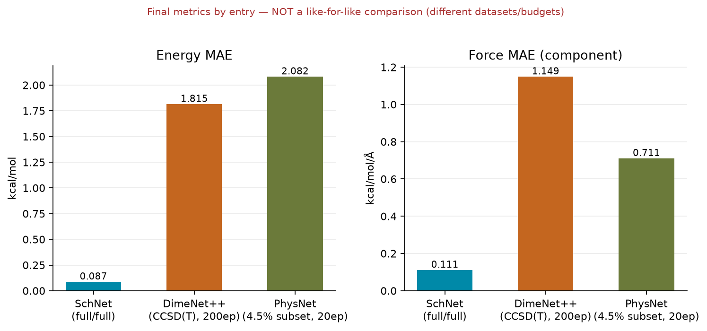

**Project:** PG-S2-47 — Hydrogen Production Materials Discovery Using Deep
Neural Networks
**Scope:** this document summarises the actual training runs produced
during Sprint 3's Phase 1 bake-off, for the four team members whose work
could be directly verified from the shared repository — Alex Tanui
(SchNet), Ruturaj Yashwant Bhosale (MPNN), Dongxiao Wu (DimeNet++), and
Shijin Mathew (PhysNet). Fazin Faizal's PaiNN entry is noted briefly at
the end: it is fully implemented and tested, but its own model card states
explicitly that no training run has been performed yet, so there are no
training results to summarise for it here.

**A note on comparability, upfront, because it matters more than any
single number below:** the whole point of Sprint 3 was to train all five
architectures under identical conditions — same data, same split, same
epoch budget — so the results could be ranked against each other fairly.
As things stand, only one entry (SchNet) was trained that way. The other
three each trained under a materially different condition — a different
dataset, a different theory level, or a small fraction of the data — for
reasons explained in each section. None of the numbers below should be
read as "X is more accurate than Y" until that is fixed. What they do show
is that every architecture works correctly end-to-end, which is itself the
harder and more valuable thing to have verified this sprint.

---

## Alex Tanui — SchNet

**Status: fully trained, full dataset, directly comparable.**

SchNet uses continuous-filter convolutions over Gaussian-expanded
interatomic distance. It was trained for the complete 200-epoch budget on
the full training split of MD17 ethanol at the DFT level of theory — the
dataset and split every bake-off entry was meant to share.

| Setting | Value |
|---|---|
| Dataset | `ethanol_dft`, full split (444,074 train / 55,509 val / 55,509 test) |
| Architecture | `hidden_channels=64`, `num_layers=3`, `num_rbf=16`, `cutoff=5.0 Å` |
| Epochs run | 200 of 200 (never triggered early stopping) |
| Training time | 30,029 s (~8h 20m), CPU |

| Metric (held-out test set, 55,509 frames) | Value |
|---|---|
| Energy MAE | 0.0873 kcal/mol |
| Energy RMSE | 0.1026 kcal/mol |
| Force MAE (component) | 0.1114 kcal/mol/Å |
| Force RMSE (component) | 0.1628 kcal/mol/Å |
| Inference time | 9.03 s total / 0.163 ms per frame |

**What was observed during training:** loss decreased consistently for the
full 200 epochs without plateauing into early stopping, and train/validation
loss tracked each other closely throughout — the signature of a model that
is still learning rather than overfitting. A key implementation decision
was shifting the training target by the dataset's mean energy
(ethanol's raw energy sits at approximately −97,196 kcal/mol with a
standard deviation of only ~4.2 kcal/mol); without this, training spends
most of its effort just learning the huge constant offset rather than the
physically meaningful variation. The shift is reversed before metrics are
computed, so the numbers above are genuine physical units. The full
interactive training-curve and parity dashboard remains published
separately; the two charts below are regenerated directly from the saved
checkpoint against the real test set, for this static document.

{ width=48% }
{ width=48% }

Full detail: `docs/model_cards/schnet.md`.

---

## Ruturaj Yashwant Bhosale — MPNN

**Status: implemented and verified working; not yet trained.**

Ruturaj's contribution this sprint was twofold: the MPNN baseline itself
(a Gilmer-style message-passing network — the project's original Phase 1
default architecture), and, alongside it, the shared configuration system
(`ml/config.py`) and training loop (`ml/training/train.py`) that every
other bake-off entry's training now depends on.

A real bug was found and fixed in the course of this work: the model was
computing forces from a pre-stored edge feature with no gradient
connection back to atomic positions, which would have produced forces of
exactly zero with no error raised. This was corrected to recompute the
relevant features from live atomic positions, matching the approach
independently arrived at in the SchNet and PhysNet entries.

| Setting | Value |
|---|---|
| Dataset | `ethanol_dft` |
| Architecture | `hidden_channels=128`, `num_layers=4`, `num_rbf=50` |
| Run performed | `--smoke-test` verification only |
| Frames evaluated | 96 (a tiny slice, not the real validation/test set) |
| Training time | 0.39 s |

The smoke test exists to prove the harness runs end-to-end without
crashing, not to produce a usable accuracy number — the resulting metrics
(energy MAE ≈ 8.8 kcal/mol, force MAE ≈ 20.7 kcal/mol/Å, best validation
loss ≈ 50,979) reflect an essentially untrained network and are included
here only for completeness, not as a result to compare against the other
three entries. **A full 200-epoch training run on the shared dataset has
not yet been performed.** The harness this entry built is what makes that
run possible for every other architecture, including MPNN itself — running
it is the immediate next step, not a blocked dependency.

---

## Dongxiao Wu — DimeNet++

**Status: trained and extensively analysed; on a different dataset than the shared split.**

DimeNet++ uses directional message passing — incorporating bond angles as
well as distances — and was trained at 100 and then 200 epochs, with a
dedicated follow-up investigation into energy prediction bias and
calibration.

**Important caveat:** this was trained on **ethanol at the CCSD(T) level
of theory**, not the DFT-level `ethanol_dft` dataset the rest of the
bake-off uses, and on a much smaller split — 889 training / 111 validation
configurations, versus the 444,074/55,509/55,509 split everyone else
trains against. CCSD(T) is a higher-accuracy but far more expensive
reference than DFT, and the two are never pooled or directly compared in
this project's data schema. This entry's numbers are a legitimate result
in their own right, but are **not yet comparable** to SchNet's, PhysNet's,
or MPNN's — that requires a re-run on the shared `ethanol_dft` split.

| Setting | Value |
|---|---|
| Dataset | ethanol, **CCSD(T)**, 889 train / 111 val configs |
| Learning rate | 1e-4 · batch size 4 · seed 42 |
| Loss weighting | energy 1.0 / force 100.0 (same convention as the rest of the bake-off) |

| Metric (validation set) | 100-epoch model | 200-epoch model |
|---|---:|---:|
| Energy MAE | 1.634 kcal/mol | 1.815 kcal/mol |
| Energy RMSE | 1.750 kcal/mol | 1.880 kcal/mol |
| Force MAE (component) | 1.564 kcal/mol/Å | 1.149 kcal/mol/Å |
| Force RMSE (component) | 2.178 kcal/mol/Å | 1.582 kcal/mol/Å |

**What was observed:** extending training from 100 to 200 epochs increased
energy error by about 11% but decreased force error by about 27%. Model
selection used a combined validation score weighting force error more
heavily (matching the project's `force_loss_weight: 100` convention), which
favours the 200-epoch checkpoint overall — but the analysis is explicit
that this does not mean every individual metric improved, and that
convergence is not established at the 200-epoch boundary. The checkpoint
and gold-data hashes were independently verified to confirm the recomputed
metrics match the saved record exactly.

{ width=80% }

{ width=80% }

Full detail: `docs/model_cards/dongxiao_dimenet_ethanol_200.md`.

---

## Shijin Mathew — PhysNet

**Status: trained on a representative subset; not yet the full dataset.**

PhysNet predicts energy as a sum of atom-wise contributions (short-range
term only, as the ticket specifies, since MD17 ethanol is a single neutral
molecule with no long-range or charge-transfer regime for the omitted
electrostatic/dispersion terms to act over). The implementation carries
22 passing unit tests, including a finite-difference check pinning the
same autograd-forces correctness issue found independently in the MPNN and
SchNet entries.

**Important caveat:** CPU training on the full 444,074-frame dataset was
measured at approximately 57 minutes per epoch — roughly 8 days for the
configured 200-epoch budget — and was not feasible within the sprint.
Training instead ran on a **20,000-frame subset (4.5% of the full
training data) for 20 epochs**, explicitly recorded as a subset result in
the model card and not intended for direct comparison against a
full-dataset entry.

| Setting | Value |
|---|---|
| Dataset | `ethanol_dft`, **20,000-of-444,074 train subset**, 2,000 validation configs scored |
| Epochs run | 20 |
| Parameters | 808,746 |
| Training time | 3,425 s |
| Inference time | 2.96 ms/config |

| Metric (2,000-config validation subset) | Value |
|---|---|
| Energy MAE | 2.082 kcal/mol (0.231 kcal/mol/atom) |
| Energy RMSE | 2.104 kcal/mol (0.234 kcal/mol/atom) |
| Force MAE (component) | 0.711 kcal/mol/Å (1.430 per atom-norm) |
| Force RMSE (component) | 1.094 kcal/mol/Å (1.895 per atom-norm) |

**What was observed:** for context, the same model on an even smaller
2,000-config, 2-epoch smoke run scored far worse (energy MAE 18.44, force
MAE 6.81) — so a roughly 10× increase in both data and epochs improved
both metrics by roughly 9×, indicating the model is learning correctly but
is still well short of converged at this budget. Beyond the model itself,
this entry's integration testing against other team members' branches
surfaced a real interface inconsistency before it could silently affect
results — documented as a general risk for the rest of the bake-off, not
just this entry. Full detail: `docs/model_cards/physnet.md`.

---

## Fazin Faizal — PaiNN (for completeness)

PaiNN — an equivariant architecture carrying directional, not just
distance, information between atoms — is fully implemented, symmetry-
tested (rotational equivariance verified by automated test), and connected
to the shared evaluation harness and model registry Fazin also built this
sprint. Its own model card states training results are "deliberately
blank," because the shared training loop did not yet exist at the time it
was written. No training metrics exist for this entry as of this report.

---

## Summary table

| Person | Model | Dataset used | Epochs | Comparable to shared bake-off? |
|---|---|---|---:|---|
| Alex Tanui | SchNet | `ethanol_dft`, full split | 200 | **Yes — reference result** |
| Ruturaj Yashwant Bhosale | MPNN | `ethanol_dft` | smoke-test only | No — not yet trained |
| Dongxiao Wu | DimeNet++ | ethanol **CCSD(T)**, 889/111 split | 200 | No — different theory level/dataset size |
| Shijin Mathew | PhysNet | `ethanol_dft`, 20k-frame subset | 20 | No — partial data/epoch budget |
| Fazin Faizal | PaiNN | — | — | No — not yet trained |

{ width=92% }

## What this means for Sprint 4

The immediate priority, carried directly from the Sprint 3 retrospective,
is bringing the remaining four entries onto the same footing as SchNet:
a full training run on MPNN now that the shared loop exists, a re-run of
DimeNet++ on the shared DFT split, an agreed and realistic training budget
for PhysNet given its measured CPU cost, and a completed training run for
PaiNN. Only once that is done does selecting a Phase 1 baseline architecture
become a conclusion the data actually supports.
